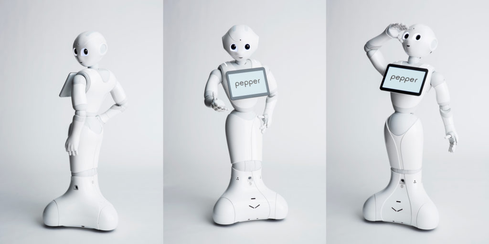

# RoboDemo
> This repo contains several demos of the pepper robot. It is intended to be used at public outreach activities.

[![Build Status][travis-image]][travis-url]

One to two paragraph statement about your product and what it does.

## Usage example

* demo: A folder that contains a complete demo project of pepper. It can be used by Choregraphe 2.4.3.
* speech_mimicry.py: A python file that takes audio input from microphone, recognise it, send it to peper and make pepper to speak in its own voice.

## Development setup

None

## Release History

* 0.0.1
    * Work in progress

## Meta

Alex Yuan Gao – gaoyuankidult@gmail.com

Distributed under the MIT license. See ``LICENSE`` for more information.

[https://github.com/gaoyuankidult/RoboDemo](https://github.com/gaoyuankidult/)

## LICENCE

[MIT Licence](https://en.wikipedia.org/wiki/MIT_License)

[npm-image]: https://img.shields.io/npm/v/datadog-metrics.svg?style=flat-square
[npm-url]: https://npmjs.org/package/datadog-metrics
[npm-downloads]: https://img.shields.io/npm/dm/datadog-metrics.svg?style=flat-square
[travis-image]: https://img.shields.io/travis/dbader/node-datadog-metrics/master.svg?style=flat-square
[travis-url]: https://travis-ci.org/dbader/node-datadog-metrics
